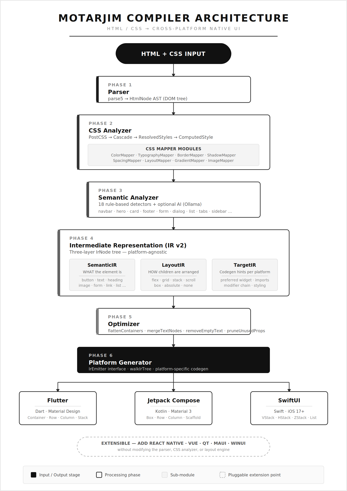

# motarjim

<p align="center">
  
</p>

**HTML/CSS → Native UI Code compiler** for Flutter, Jetpack Compose, and SwiftUI.

Write once in HTML/CSS. Ship native code for every platform.

[]()
[]()
[]()
[]()

---

## Features

- **Local-first** — Zero cloud dependencies. Everything runs on your machine.
- **Multi-platform** — Generate Flutter (Dart), Jetpack Compose (Kotlin), or SwiftUI from the same HTML/CSS.
- **Rust engine** — The Rust workspace under `crates/` is the single source of truth; parse → analyze → optimize → generate, no runtime, no WebView.
- **JavaScript front end** — `motarjim-js` parses variables, functions, arrow functions, template literals, imports/exports, and extracts DOM event bindings.
- **493 tests** across the Rust workspace, plus fuzz targets and Criterion benchmarks per parser.
- **Diagnostics with error codes** — Rust-style `E0001`-`E0799` diagnostics with severities, spans, and notes (see `motarjim-diag`).

## Architecture

<p align="center">
  
</p>

## Pipeline Stages

| # | Stage | Description |
|---|-------|-------------|
| 1 | **Parse** | Parse HTML with parse5 → `HtmlNode` AST |
| 2 | **Style** | Analyze CSS with PostCSS → cascade → `StyledNode` tree |
| 3 | **Analyze** | 18 rule-based detectors + optional AI (Ollama) → `SemanticHint[]` |
| 4 | **IR** | Build platform-agnostic `IrNode` tree (SemanticIR / LayoutIR / TargetIR) |
| 5 | **Optimize** | flattenContainers · mergeTextNodes · removeEmptyText · pruneUnusedProps |
| 6 | **Generate** | Walk IR tree → emit Flutter / Compose / SwiftUI code |

## Supported Targets

| Platform | Language | Widget Set |
|----------|----------|------------|
| Flutter | Dart | Material Design |
| Jetpack Compose | Kotlin | Material 3 |
| SwiftUI | Swift | iOS 17+ |

## Web Playground

motarjim ships with a restored Vite playground in `apps/playground` at `http://localhost:3000`:

```
npm run start:playground
```

The web UI provides:

- **Split-panel editor** — HTML/CSS tabs on the left, generated code on the right
- **Pipeline visualizer** — Animated stage-by-stage progress bar
- **Platform switcher** — Toggle between Flutter, Compose, and SwiftUI output
- **Dark/light theme** — Persisted to local storage
- **Code actions** — Paste, format, upload file, clear, load sample
- **Status bar** — Compile time, node count, components detected, generated lines
- **Command palette** — `Ctrl+K` or `?` for quick actions
- **Auto-save drafts** — Work persists across sessions
- **Error cards** — Detailed error messages with line info and copy action

## Quick Start

### Installation

```bash
# From source (published crates.io release not yet available)
git clone https://github.com/abdelrzz9/motarjim.git
cd motarjim
cargo build --release -p motarjim-cli
./target/release/motarjim --help
```

### CLI Usage

The Rust CLI (`motarjim-cli`) currently supports:

```bash
# Compile HTML to a target platform (flutter | compose | swiftui)
motarjim compile index.html --platform flutter

# Write output to a file instead of stdout
motarjim compile index.html --platform swiftui --output ContentView.swift

# Minify output / emit source maps / treat warnings as errors
motarjim compile index.html --platform compose --minify --source-maps --strict

# Create a default motarjim.json config in the current directory
motarjim init

# Check a file for diagnostics without generating output
# (.html/.css go through the full compiler pipeline in strict mode;
#  .js/.mjs/.jsx are parsed and semantically analyzed by motarjim-js)
motarjim check index.html
motarjim check app.js

# Watch mode is scaffolded but not yet implemented
motarjim watch index.html --platform flutter
```

See [docs/cli.md](docs/cli.md) — note this doc still needs a rewrite against
the current Rust CLI; treat `motarjim --help` as the source of truth in the
meantime. There is no HTTP API; `motarjim-core` is a library embedded by the
CLI, LSP, and (eventually) WASM bindings, not a server.

## Examples

### Input

```html
<nav class="navbar">
  <h1>My App</h1>
</nav>
<section class="hero">
  <h1>Welcome</h1>
  <p>Build something great</p>
  <button>Get Started</button>
</section>
```

```css
.navbar { background: #333; color: white; padding: 1rem; }
.hero { text-align: center; padding: 4rem; background: #1a1a2e; color: white; }
button { background: blue; color: white; border-radius: 8px; padding: 12px 24px; }
```

### Generated Flutter

```dart
import 'package:flutter/material.dart';

class GeneratedView extends StatelessWidget {
  @override
  Widget build(BuildContext context) {
    return Column(
      children: [
        AppBar(title: Text("My App")),
        Column(
          children: [
            Text("Welcome"),
            Text("Build something great"),
            ElevatedButton(
              onPressed: () {},
              child: Text("Get Started"),
            ),
          ],
        ),
      ],
    );
  }
}
```

### Generated Compose

```kotlin
import androidx.compose.material3.*
import androidx.compose.runtime.*

@Composable
fun GeneratedView() {
    Column {
        TopAppBar(title = { Text("My App") })
        Column {
            Text(text = "Welcome")
            Text(text = "Build something great")
            Button(onClick = { }) {
                Text(text = "Get Started")
            }
        }
    }
}
```

### Generated SwiftUI

```swift
import SwiftUI

struct GeneratedView: View {
    var body: some View {
        VStack {
            Text("My App")
                .navigationTitle("My App")
            VStack {
                Text("Welcome")
                Text("Build something great")
                Button("Get Started") {
                    // action
                }
            }
        }
    }
}
```

## TypeScript apps and packages

The repository keeps runnable TypeScript applications separate from reusable TypeScript packages:

- `apps/playground` — restored Vite playground that was previously under `web/`.
- `apps/website` — documentation/marketing website shell.
- `packages/vscode-extension` — VS Code extension workspace for editor integration.
- `packages/playground-sdk` — shared playground request and target types.
- `packages/website-sdk` — shared website navigation metadata.

Common commands:

```bash
npm install
npm run start:playground
npm run start:website
```

See [docs/web-and-vscode.md](docs/web-and-vscode.md) for details.

## AI Enhancement

Optional Ollama integration for improved component detection:

```bash
motarjim convert index.html --ai-enhance

# With custom model
motarjim convert index.html --ai-enhance --ai-model llama3
```

See [docs/ai-enhancement.md](docs/ai-enhancement.md) for setup instructions.

## Performance Benchmarks

| Metric | Value |
|--------|-------|
| Pipeline (1000 nodes) | **98ms** median |
| Target | 500ms |
| Headroom | **5.1×** |
| Generators (all 3) | +13ms |

See [docs/benchmarks.md](docs/benchmarks.md) for detailed results.

## Roadmap

- [x] Rust compiler workspace (`motarjim-parser`, `motarjim-css`, `motarjim-ir`,
      `motarjim-optimizer`, 3 platform generators, `motarjim-core`)
- [x] JavaScript front end (`motarjim-js`): lexer, parser, AST, semantic
      analysis, DOM event extraction, transforms
- [ ] Wire `motarjim-js` DOM events into the IR/generators
- [ ] CSS value mapping (colors, padding, etc.)
- [ ] Responsive design generation
- [ ] Advanced CSS selectors
- [ ] `motarjim watch` (currently a stub)
- [ ] VS Code extension LSP wiring (workspace scaffold exists; not yet functional)

See [docs/roadmap.md](docs/roadmap.md) for the full roadmap, including a note
on which docs are still being rewritten for the Rust engine.

## Documentation

- [Introduction](docs/introduction.md)
- [Architecture](docs/architecture.md)
- [Pipeline](docs/pipeline.md)
- [Parser](docs/parser.md)
- [JavaScript Support](docs/javascript.md)
- [CSS Analyzer](docs/css-analyzer.md)
- [Semantic Analyzer](docs/semantic-analyzer.md)
- [IR (Intermediate Representation)](docs/ir.md)
- [Optimizer](docs/optimizer.md)
- [Generator Core](docs/generator-core.md)
- [Flutter Generator](docs/flutter-generator.md)
- [Compose Generator](docs/compose-generator.md)
- [SwiftUI Generator](docs/swiftui-generator.md)
- [CLI Reference](docs/cli.md)
- [AI Enhancement](docs/ai-enhancement.md)
- [Benchmarks](docs/benchmarks.md)
- [Contributing](docs/contributing.md)
- [Troubleshooting](docs/troubleshooting.md)
- [FAQ](docs/faq.md)
- [Roadmap](docs/roadmap.md)
- [Web apps and VS Code extension](docs/web-and-vscode.md)

## Contributing

See [docs/contributing.md](docs/contributing.md) for setup, workflow, and coding standards.

## License

MIT

## Repository architecture

```text
motarjim/
├── crates/                 # Rust workspace
│   ├── motarjim-core
│   ├── motarjim-parser
│   ├── motarjim-css
│   ├── motarjim-optimizer
│   ├── motarjim-gen-flutter
│   ├── motarjim-gen-compose
│   ├── motarjim-gen-swiftui
│   ├── motarjim-cli
│   ├── motarjim-lsp
│   └── ...
├── packages/               # TypeScript
│   ├── vscode-extension
│   ├── playground-sdk
│   └── website-sdk
├── apps/
│   ├── website
│   └── playground
├── docs/
├── examples/
├── benchmarks/
├── tests/
├── scripts/
├── xtask/
├── Cargo.toml
├── package.json
└── README.md
```
