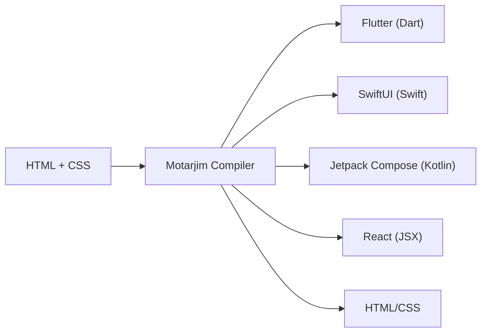
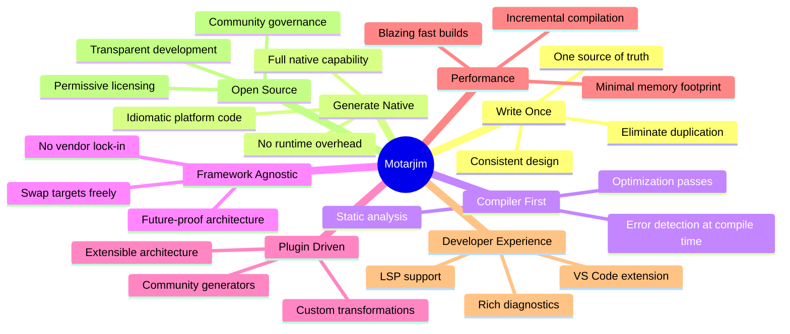
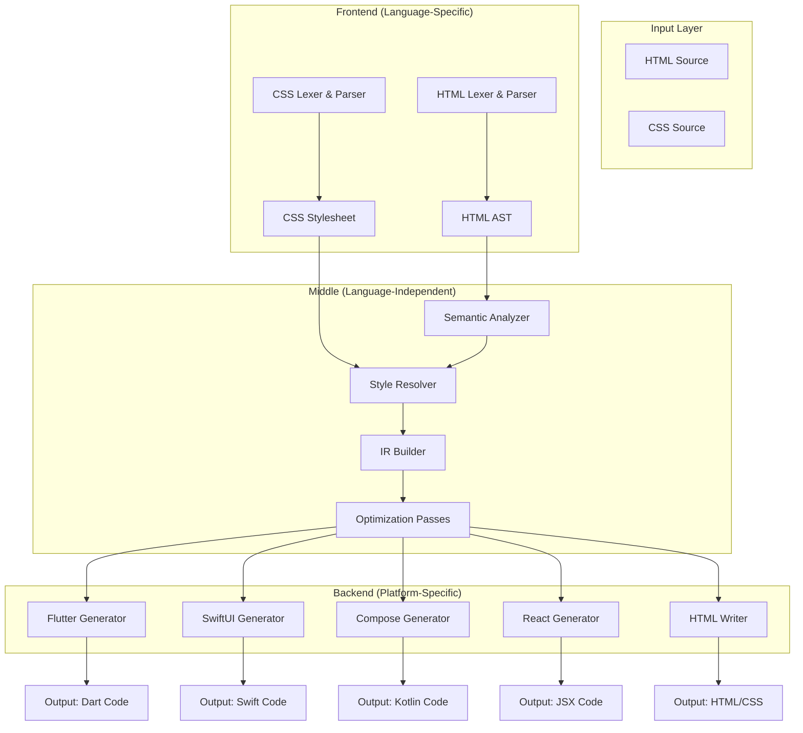
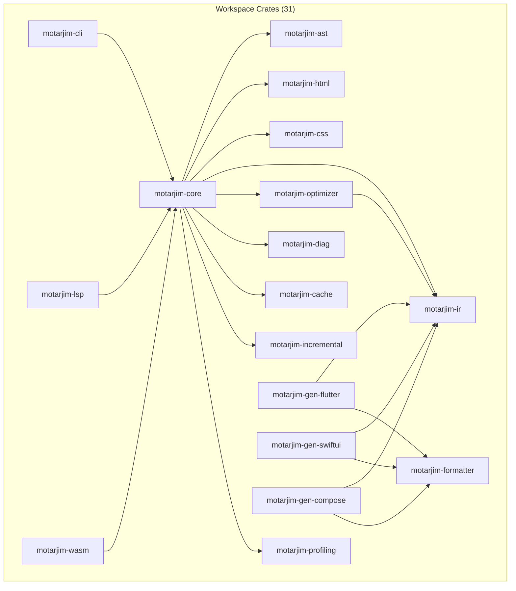
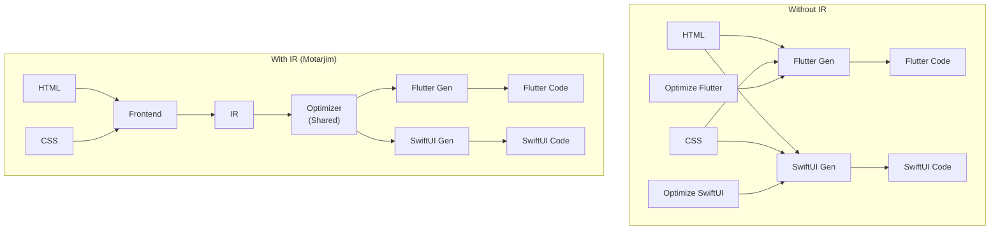
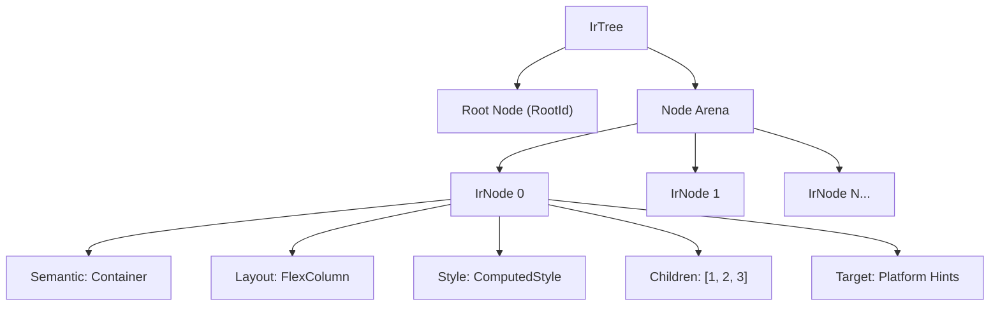
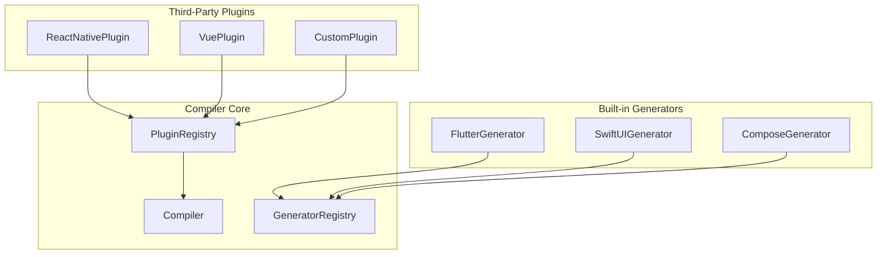
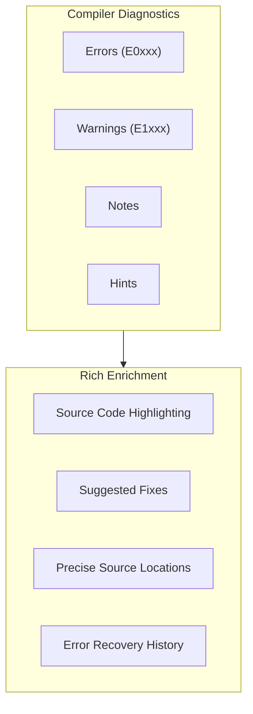

<p align="center">
  <picture>
    <source media="(prefers-color-scheme: dark)" srcset="motarjim.png">
    
  </picture>
</p>

<h1 align="center">Motarjim</h1>

<h3 align="center">The Universal UI Compiler</h3>

<p align="center">
  Write UI once. Generate native applications everywhere.
</p>

<p align="center">
  <em>An open-source compiler that translates modern UI code into multiple native frameworks.</em>
</p>

<p align="center">
  <a href="https://github.com/motarjim/motarjim"></a>
  <a href="https://crates.io/crates/motarjim"></a>
  <a href="https://www.npmjs.com/package/@motarjim/web"></a>
  <a href="https://pub.dev/packages/motarjim"></a>
  <a href="https://github.com/motarjim/motarjim/actions"></a>
  <br>
  <a href="https://docs.motarjim.dev"></a>
  <a href="LICENSE"></a>
  <a href="https://discord.gg/motarjim"></a>
  <a href="https://github.com/sponsors/motarjim"></a>
</p>

<p align="center">
  <a href="#introduction">Introduction</a> •
  <a href="#features">Features</a> •
  <a href="#compiler-architecture">Architecture</a> •
  <a href="#getting-started">Getting Started</a> •
  <a href="#cli">CLI</a> •
  <a href="#roadmap">Roadmap</a> •
  <a href="#contributing">Contributing</a>
</p>

<br>

---

<br>

<p align="center">
  <picture>
    <source media="(prefers-color-scheme: dark)" srcset="">
    
  </picture>
  <br>
  <sub><em>Screenshot coming soon — show the compilation pipeline in action</em></sub>
</p>

<br>

---

<br>

## Demo

<p align="center">
  <table>
    <tr>
      <td align="center"><strong>▶️ Animated Demo</strong><br><br><br><sub><em>Compiling HTML/CSS to Flutter, SwiftUI, and Jetpack Compose in real-time</em></sub></td>
      <td align="center"><strong>🎮 Live Playground</strong><br><br><a href="https://play.motarjim.dev"></a><br><sub><em>Try Motarjim online at <strong>play.motarjim.dev</strong></em></sub></td>
    </tr>
  </table>
</p>

<br>

---

<br>

## Screenshots

| | |
|---|---|
| <br><sub>Online Playground</sub> | <br><sub>Terminal CLI</sub> |
| <br><sub>Generated Code Output</sub> | <br><sub>Intermediate Representation Viewer</sub> |
| <br><sub>Abstract Syntax Tree Viewer</sub> | <br><sub>Optimization Pass Inspector</sub> |
| <br><sub>Documentation Website</sub> | <br><sub>Compiler Diagnostics & Error Reporting</sub> |

<br>

---

<br>

## Table of Contents

- [Introduction](#introduction)
- [Philosophy](#philosophy)
- [Features](#features)
- [Supported Platforms](#supported-platforms)
- [Compiler Architecture](#compiler-architecture)
- [Compilation Pipeline](#compilation-pipeline)
- [Intermediate Representation (IR)](#intermediate-representation-ir)
- [Optimizations](#optimizations)
- [Project Structure](#project-structure)
- [Technology Stack](#technology-stack)
- [Getting Started](#getting-started)
- [CLI](#cli)
- [Playground](#playground)
- [Plugin System](#plugin-system)
- [Error Reporting](#error-reporting)
- [Configuration](#configuration)
- [Roadmap](#roadmap)
- [Upcoming Features](#upcoming-features)
- [Performance](#performance)
- [Testing](#testing)
- [Benchmarks](#benchmarks)
- [Documentation](#documentation)
- [Contributing](#contributing)
- [FAQ](#faq)
- [Security](#security)
- [License](#license)
- [Credits](#credits)
- [Acknowledgements](#acknowledgements)
- [Community](#community)
- [Changelog](#changelog)
- [Contributors](#contributors)
- [Star History](#star-history)

<br>

---

<br>

## Introduction

**Motarjim** is an open-source, compiler-driven development tool that translates standard web UI (HTML + CSS) into idiomatic, native code for multiple application frameworks.



### Why Motarjim?

The frontend ecosystem is fragmented. Every platform — mobile, desktop, web — comes with its own UI paradigm, its own language, and its own framework conventions. Teams that target multiple platforms today face an impossible choice:

- **Duplicate effort** — Maintain separate codebases for each platform, each with its own bugs, its own design decisions, and its own tech debt.
- **Cross-platform compromises** — Use a cross-platform framework that abstracts away native capabilities, trading performance and platform fidelity for code sharing.
- **Manual translation** — Write in one framework and manually port to others, a slow, error-prone process that never quite stays in sync.

Motarjim eliminates this trilemma. Instead of choosing between duplication, abstraction, or manual translation, you write your UI once in standard HTML and CSS, and the compiler generates high-quality, idiomatic native code for every platform you target.

### What Makes Motarjim Different?

| | Traditional Frameworks | Code Generators | **Motarjim** |
|---|---|---|---|
| **Approach** | Runtime interpretation | Template rendering | **Compiler pipeline** |
| **Architecture** | Monolithic runtime | String templating | **Multi-stage IR** |
| **Extensibility** | Framework plugins | Fixed outputs | **Plugin system** |
| **Optimization** | JIT/runtime | None | **Static analysis + passes** |
| **Output** | Runs everywhere | One target | **Multi-target codegen** |
| **Language** | Framework-specific | Limited DSL | **Standard HTML/CSS** |

Motarjim treats UI transformation as a **compilation problem** — not a runtime one. This fundamental shift unlocks capabilities that runtime frameworks cannot offer: static optimization, multi-target code generation, deep static analysis, and a plugin architecture that grows with the ecosystem.

<br>

---

<br>

## Philosophy



- **Write Once, Generate Native** — One HTML/CSS source produces idiomatic Flutter, SwiftUI, Compose, and React code. No runtime interpreters. No abstraction layers. Just native code.
- **Compiler First** — By treating UI as code to be compiled, Motarjim can analyze, optimize, and transform it in ways no runtime framework can. Errors are caught at compile time, not runtime.
- **Framework Agnostic** — Motarjim has no allegiance to any single framework. Its architecture is designed to generate code for any UI paradigm — existing or future.
- **Plugin Driven** — The entire compilation pipeline is extensible. New languages, frameworks, and transformations can be added as plugins without modifying the compiler core.
- **Performance by Design** — Rust-powered compilation pipeline with incremental builds, parallel processing, and intelligent caching ensures sub-second compilation for most projects.
- **Developer Experience First** — Rich diagnostics with source highlighting, LSP integration, VS Code extension, and a web playground make the compiler approachable and productive.
- **Community Governed** — Motarjim is and always will be open source. Development is driven by the community, for the community, under permissive licensing (Apache-2.0 / MIT).

<br>

---

<br>

## Features

| Feature | Description | Status |
|---|---|---|
| **Multi-platform code generation** | Generate native code for Flutter, SwiftUI, Jetpack Compose, React, and HTML | ✅ Available |
| **Compiler pipeline** | Complete multi-stage compilation pipeline (Parse → Analyze → IR → Optimize → Generate) | ✅ Available |
| **Abstract Syntax Tree (AST)** | Structured AST for HTML, CSS, and the intermediate representation | ✅ Available |
| **Intermediate Representation (IR)** | Platform-independent IR decoupling analysis from generation | ✅ Available |
| **Optimization passes** | Dead node elimination, constant folding, style merging, tree shaking, and more | ✅ Available |
| **Incremental compilation** | Skip unchanged files; rebuild only what changed | ✅ Available |
| **Artifact caching** | Content-addressed cache avoids redundant recomputation | ✅ Available |
| **Command-line interface** | Full-featured CLI with compile, watch, init, and check commands | ✅ Available |
| **Library API** | Use Motarjim as a Rust library in your own tools | ✅ Available |
| **Plugin architecture** | Extend the compiler with custom generators, parsers, and optimizers | ✅ Available |
| **Code formatting** | Consistent code output via the `motarjim-formatter` crate | ✅ Available |
| **Compiler diagnostics** | Rich error reporting with error codes, severity levels, and suggestions | ✅ Available |
| **Source maps** | Map generated code back to source HTML/CSS locations | ✅ Available |
| **Hot reload support** | Watch mode for automatic recompilation on file changes | 🚧 Planned |
| **Web playground** | Online IDE with live preview, AST/IR visualization | ✅ Available |
| **Configuration system** | JSON and TOML configuration with sensible defaults | ✅ Available |
| **Watch mode** | File watching with debounced recompilation | 🚧 Planned |
| **Static analysis** | Type-check, lint, and validate UI code without generating output | ✅ Available |
| **Tree shaking** | Eliminate unused styles and components from the output | ✅ Available |
| **Custom transformations** | Write your own compiler passes to transform the IR | ✅ Available |
| **Testing infrastructure** | 500+ tests, fuzzing, property-based testing, snapshot testing | ✅ Available |
| **Extensible generators** | Add new target frameworks via the `Generator` trait | ✅ Available |
| **Cross-language support** | JavaScript lexer, parser, and semantic analyzer | ✅ Available |
| **LSP server** | Language Server Protocol implementation for IDE integration | ✅ Available |
| **WASM bindings** | Compile Motarjim to WebAssembly for browser use | ✅ Available |
| **C FFI bridge** | Foreign Function Interface for embedding in non-Rust projects | ✅ Available |
| **Profiling infrastructure** | Phase-level timing instrumentation for performance analysis | ✅ Available |

<br>

---

<br>

## Supported Platforms

| Framework | Status | Language | Generator Crate | Example |
|---|---|---|---|---|
| **Flutter** | ✅ Available | Dart | `motarjim-gen-flutter` | [View Example](#) |
| **SwiftUI** | ✅ Available | Swift | `motarjim-gen-swiftui` | [View Example](#) |
| **Jetpack Compose** | ✅ Available | Kotlin | `motarjim-gen-compose` | [View Example](#) |
| **React (JSX)** | ✅ Available | TypeScript/JSX | `motarjim-gen-react` | [View Example](#) |
| **HTML/CSS** | ✅ Available | HTML/CSS | `motarjim-gen-html` | [View Example](#) |
| **Vue** | 🚧 Planned | TypeScript/Vue | — | — |
| **Svelte** | 🚧 Planned | TypeScript/Svelte | — | — |
| **SolidJS** | 🚧 Planned | TypeScript/JSX | — | — |
| **Angular** | 🚧 Planned | TypeScript/Angular | — | — |
| **Compose Multiplatform** | 🚧 Planned | Kotlin | — | — |
| **React Native** | 🚧 Planned | TypeScript/JSX | — | — |
| **Qt/QML** | 🔍 Investigating | QML/C++ | — | — |
| **GTK** | 🔍 Investigating | C/Vala | — | — |

> **Can't find your framework?** Motarjim's plugin system makes it straightforward to [add your own generator](#plugin-system). Community contributions are welcome!

<br>

---

<br>

## Compiler Architecture

Motarjim's architecture is modeled after classic compiler design, following the same principles as LLVM, GCC, and Rustc.

### High-Level Architecture



### Compilation Pipeline (Detailed)


### Dependencies



### Stage Descriptions

#### 1. Lexer

The first stage of the pipeline breaks raw source code into a stream of **tokens**. Motarjim includes dedicated lexers for HTML, CSS, and JavaScript.

```rust
// Example tokens produced by the HTML lexer
pub enum HtmlToken {
    TagOpen(SmolStr),
    TagClose(SmolStr),
    Attribute(SmolStr, SmolStr),
    Text(SmolStr),
    Comment(SmolStr),
    Doctype {
        name: SmolStr,
        public_id: SmolStr,
        system_id: SmolStr,
    },
    Eof,
}
```

**Key characteristics:**
- Zero-copy where possible using `SmolStr`
- Error recovery: produce partial token streams even on malformed input
- Source location tracking for rich diagnostics
- Configurable via Cargo features

#### 2. Parser

The parser consumes the token stream and produces a structured **Abstract Syntax Tree (AST)**. Separate parsers exist for HTML and CSS.

**HTML Parser** (`motarjim-html`):
- Alternative between a custom fast parser and a wrapper around `html5ever`
- Produces a tree of `Node` values with `Element`, `Text`, `Comment`, and `Doctype` variants
- Handles namespaces, void elements, and raw text elements

**CSS Parser** (`motarjim-parser`):
- Parses selectors, declarations, at-rules, and values
- Full selector specificity calculation (ID, class, tag, attribute, pseudo-class, pseudo-element)
- Supports combinators: descendant, child, adjacent sibling, general sibling
- At-rule support: `@media`, `@keyframes`, `@font-face`, `@import`

**JavaScript Parser** (`motarjim-js`):
- ECMAScript-compatible lexer and parser
- Produces ESTree-compatible AST nodes
- Supports JSX syntax extensions

```rust
// Simplified AST node for HTML
struct HtmlNode {
    id: NodeId,
    node_type: NodeType,     // Element, Text, Comment, DocumentType
    element: Option<Element>, // Tag name, attributes, id, classes
    value: Option<String>,   // For text/comment nodes
    children: Vec<NodeId>,
    parent: Option<NodeId>,
    depth: u32,
}
```

#### 3. Semantic Analyzer

The semantic analyzer enriches the AST with meaning:
- Resolves element roles and semantics (button, heading, navigation, etc.)
- Validates document structure (e.g., heading hierarchy)
- Infers accessibility attributes
- Performs cross-referencing (ID resolution, anchor targets)

#### 4. Style Analyzer

The CSS engine is one of Motarjim's deepest components:


- **Selector matching** — Finds all CSS rules matching each HTML element, with full specificity calculation
- **Cascade resolution** — Sorts matching rules by origin, specificity, and source order; handles `!important`, `inherit`, `initial`, `unset`
- **Property application** — Shorthand expansion (e.g., `margin: 10px 20px` → `margin-top`, `margin-right`, etc.), type coercion, and validation
- **CSS variable resolution** — `var(--name)` substitution with custom property registry and cycle detection
- **`calc()` evaluation** — Recursive-descent arithmetic with unit conversion and percentage resolution
- **Media query evaluation** — Condition matching against configurable viewport and user preferences
- **Vendor prefix generation** — Automatic `-webkit-`, `-moz-`, `-ms-` prefix insertion

```rust
struct ComputedStyle {
    // Typography
    color: Option<String>,
    font_size: Option<String>,
    font_family: Option<String>,
    font_weight: Option<String>,
    text_align: Option<String>,

    // Box model
    width: Option<String>,
    height: Option<String>,
    margin: Option<MarginRect>,
    padding: Option<PaddingRect>,
    border: Option<Border>,
    border_radius: Option<String>,

    // Layout
    display: Option<String>,
    position: Option<String>,
    flex_direction: Option<String>,
    justify_content: Option<String>,
    align_items: Option<String>,
    gap: Option<String>,

    // Grid
    grid_template_columns: Option<GridTemplate>,
    grid_template_rows: Option<GridTemplate>,
    grid_template_areas: Option<Vec<String>>,
    grid_row: Option<GridPlacement>,
    grid_column: Option<GridPlacement>,

    // CSS custom properties
    custom_properties: HashMap<String, String>,
}
```

#### 5. IR Builder

The Intermediate Representation bridges the gap between semantic understanding and code generation. It transforms the styled, analyzed AST into a **platform-independent IR tree**.

```rust
struct IrNode {
    id: NodeId,
    semantic: SemanticIr,       // Root, Container, Text, Button, Card, Image, List, Row, Column, etc.
    layout: LayoutIr,           // Inline, FlexColumn, FlexRow, Grid, Stack, Absolute, Scrollable
    target: TargetIr,           // Platform hints for built-in generators
    computed_style: ComputedStyle,
    children: Vec<NodeId>,
    parent: Option<NodeId>,
}

enum SemanticIr {
    Root, Container, Text, Button, Row, Column, Card,
    Image, TextField, NavigationBar, AppBar, ScrollView,
    Form, Footer, List, ListItem, Icon, Divider, Spacer,
    Dialog, Modal, Tabs, Section, Article, Header, Link,
    Grid, Stack, Unknown,
}

enum LayoutIr {
    Inline, FlexColumn, FlexRow, Grid, Stack, Absolute, Scrollable, None,
}
```

#### 6. Optimization Passes

The IR undergoes a series of optimization passes:

| Pass | Description |
|---|---|
| **Dead Node Elimination** | Remove nodes that contribute nothing to the output (empty containers, invisible elements) |
| **Constant Folding** | Pre-compute constant expressions in style values |
| **Static Style Merging** | Merge identical style declarations to reduce output size |
| **Tree Shaking** | Eliminate unused CSS classes, IDs, and styles |
| **Layout Optimization** | Simplify layout hierarchies (e.g., nested flex → single flex) |
| **Asset Deduplication** | Remove duplicate asset references |
| **Component Flattening** | Flatten unnecessary wrapper components |
| **Text Merging** | Merge adjacent text nodes with identical styles |

#### 7. Code Generation

The final stage transforms the optimized IR into target-specific code. Each generator implements the `Generator` trait:

```rust
pub trait Generator: Send + Sync {
    fn name(&self) -> &'static str;
    fn generate(&self, ir: &IrTree, options: &GenerateOptions) -> Result<String, Vec<Diagnostic>>;
}
```

Built-in generators produce idiomatic code for each platform:

<details>
<summary><strong>Flutter/Dart Generator</strong></summary>

```dart
import 'package:flutter/material.dart';

class GeneratedApp extends StatelessWidget {
  const GeneratedApp({super.key});

  @override
  Widget build(BuildContext context) {
    return MaterialApp(
      home: Scaffold(
        body: Container(
          padding: const EdgeInsets.all(16.0),
          child: Column(
            crossAxisAlignment: CrossAxisAlignment.start,
            children: [
              Text(
                'Hello, World!',
                style: TextStyle(
                  fontSize: 24.0,
                  fontWeight: FontWeight.bold,
                  color: Color(0xFF333333),
                ),
              ),
              const SizedBox(height: 8.0),
              Text(
                'Generated by Motarjim.',
                style: TextStyle(
                  fontSize: 16.0,
                  color: Color(0xFF666666),
                ),
              ),
            ],
          ),
        ),
      ),
    );
  }
}
```
</details>

<details>
<summary><strong>SwiftUI Generator</strong></summary>

```swift
import SwiftUI

struct GeneratedView: View {
    var body: some View {
        VStack(alignment: .leading, spacing: 8) {
            Text("Hello, World!")
                .font(.system(size: 24, weight: .bold))
                .foregroundColor(Color(red: 0.2, green: 0.2, blue: 0.2))

            Text("Generated by Motarjim.")
                .font(.system(size: 16))
                .foregroundColor(Color(red: 0.4, green: 0.4, blue: 0.4))
        }
        .padding(16)
    }
}

#Preview {
    GeneratedView()
}
```
</details>

<details>
<summary><strong>Jetpack Compose/Kotlin Generator</strong></summary>

```kotlin
import androidx.compose.foundation.layout.*
import androidx.compose.material3.*
import androidx.compose.runtime.Composable
import androidx.compose.ui.Modifier
import androidx.compose.ui.graphics.Color
import androidx.compose.ui.text.font.FontWeight
import androidx.compose.ui.unit.dp
import androidx.compose.ui.unit.sp

@Composable
fun GeneratedView() {
    Column(
        modifier = Modifier.padding(16.dp),
        verticalArrangement = Arrangement.spacedBy(8.dp)
    ) {
        Text(
            text = "Hello, World!",
            fontSize = 24.sp,
            fontWeight = FontWeight.Bold,
            color = Color(0xFF333333)
        )
        Text(
            text = "Generated by Motarjim.",
            fontSize = 16.sp,
            color = Color(0xFF666666)
        )
    }
}
```
</details>

<br>

---

<br>

## Intermediate Representation (IR)

The IR is the heart of Motarjim's compiler architecture. It decouples frontend parsing from backend code generation, enabling the same analysis and optimization infrastructure to serve any target platform.

### Why IR?



### Advantages

| Aspect | Benefit |
|---|---|
| **Portability** | One IR serves all backends — add a new target by writing only the generator |
| **Optimization** | Optimize once in the IR, benefit all platforms simultaneously |
| **Framework Independence** | IR captures UI semantics, not framework-specific constructs |
| **Analysis** | Static analysis operates on a single representation, lowering complexity |
| **Extensibility** | New input languages (Vue, Svelte, etc.) compile to the same IR |
| **Future Scalability** | As new UI frameworks emerge, existing IR analysis is immediately applicable |

### IR Structure



Each `IrNode` encapsulates:
- **Semantic role** — What the element *means* (Button, Card, List, etc.)
- **Layout strategy** — How it positions its children (Flex, Grid, Stack, etc.)
- **Computed style** — All resolved CSS properties
- **Tree structure** — Children and parent references
- **Platform hints** — Suggestions for generators (optional)

<br>

---

<br>

## Optimizations

Optimization passes transform the IR to produce smaller, faster, more idiomatic output.


### Implemented Passes

| Pass | Description | Impact |
|---|---|---|
| **Dead Node Elimination** | Removes empty containers, invisible elements, and unreachable branches | Reduces node count by 5–20% |
| **Constant Folding** | Pre-computes constant CSS expressions (`calc(16px * 2)` → `32px`) | Reduces runtime computation |
| **Static Style Merging** | Deduplicates identical style objects across nodes | Reduces output size by 10–30% |
| **Tree Shaking** | Eliminates unused CSS classes, selectors, and keyframes | Reduces CSS payload significantly |
| **Layout Optimization** | Simplifies redundant layout hierarchies | Flattens DOM depth |
| **Asset Deduplication** | Removes duplicate asset references | Ensures each asset appears once |
| **Component Flattening** | Inlines single-child wrappers | Reduces nesting depth |
| **Text Merging** | Merges adjacent text nodes with identical styles | Produces cleaner output |

### Future Optimizations

- **Inline expansion** — Inline small, frequently-used components
- **Bundle splitting** — Separate critical vs. non-critical UI
- **Lazy loading hints** — Annotate IR for code-splitting
- **Accessibility insertion** — Auto-generate ARIA/composable descriptions
- **RTL layout transformation** — Mirror layouts for right-to-left languages
- **Dark mode specialization** — Generate platform-appropriate dark mode code

<br>

---

<br>

## Project Structure

```
motarjim/
│
├── 📁 .cargo/                    # Cargo configuration (WASM target)
├── 📁 .github/                   # CI/CD workflows, issue templates, PR templates
│   ├── workflows/
│   │   ├── ci.yml                # Main CI pipeline (build, test, lint)
│   │   ├── audit.yml             # Security audit
│   │   ├── benchmarks.yml        # Performance benchmarks
│   │   ├── release.yml           # Release automation
│   │   ├── wasm.yml              # WASM build
│   │   ├── web.yml               # Web playground deployment
│   │   ├── docker.yml            # Docker build
│   │   └── vscode-extension.yml  # VS Code extension
│   ├── ISSUE_TEMPLATE/           # Bug report, feature request, question templates
│   └── PULL_REQUEST_TEMPLATE.md
│
├── 📁 apps/                      # Application packages
│   ├── vscode-extension/         # VS Code extension (client + server)
│   │   ├── client/               # Extension client (TypeScript)
│   │   ├── server/               # LSP server adapter (TypeScript)
│   │   └── shared/               # Shared types
│   └── web/                      # Web playground (React + Vite + TypeScript)
│       ├── src/
│       │   ├── components/       # Reusable UI components
│       │   ├── design-system/    # Design system tokens and components
│       │   ├── features/         # Feature-specific modules
│       │   ├── services/         # API and service integrations
│       │   ├── stores/           # State management
│       │   └── utils/            # Utility functions
│       └── public/               # Static assets
│
├── 📁 crates/                    # Rust workspace crates (31 crates)
│   │
│   │   # ── Core Pipeline ──
│   ├── motarjim-core/            # Compiler orchestration, pipeline, Compiler struct
│   ├── motarjim-session/         # Compiler-wide state (config, filesystem, cache)
│   ├── motarjim-config/          # Configuration loading (JSON, TOML)
│   │
│   │   # ── Frontend (Language-Specific) ──
│   ├── motarjim-lexer/           # Source code lexing/tokenization
│   ├── motarjim-html/            # HTML parser (custom + html5ever)
│   ├── motarjim-parser/          # CSS parser and selector matching
│   ├── motarjim-css/             # CSS engine (cascade, variables, calc, media queries)
│   ├── motarjim-selectors/       # CSS selector parsing and specificity
│   ├── motarjim-js/              # JavaScript/JSX lexer, parser, semantic analyzer
│   │
│   │   # ── AST ──
│   ├── motarjim-ast/             # Core AST types (shared across pipeline)
│   ├── motarjim-ast-html/        # HTML-specific AST types (ComputedStyle, Grid, etc.)
│   ├── motarjim-ast-css/         # CSS-specific AST types
│   ├── motarjim-ast-ir/          # IR-specific AST types
│   │
│   │   # ── Diagnostics ──
│   ├── motarjim-diag/            # Diagnostic system (codes, severity, reporting)
│   ├── motarjim-errors/          # Error types and conversions
│   ├── motarjim-span/            # Source location tracking (spans)
│   │
│   │   # ── Middle (Language-Independent) ──
│   ├── motarjim-ir/              # IR builder (AST → IR transformation)
│   ├── motarjim-optimizer/       # Optimization passes and pass manager
│   ├── motarjim-formatter/       # Code formatting utilities (CodeWriter)
│   │
│   │   # ── Backend (Platform-Specific Generators) ──
│   ├── motarjim-gen-flutter/     # Flutter/Dart code generator
│   ├── motarjim-gen-swiftui/     # SwiftUI code generator
│   ├── motarjim-gen-compose/     # Jetpack Compose/Kotlin code generator
│   │
│   │   # ── Developer Tools ──
│   ├── motarjim-cli/             # CLI argument parsing and command dispatch
│   ├── motarjim-lsp/             # Language Server Protocol implementation
│   ├── motarjim-wasm/            # WebAssembly bindings
│   ├── motarjim-ffi/             # C Foreign Function Interface
│   │
│   │   # ── Build Infrastructure ──
│   ├── motarjim-cache/           # Content-addressed artifact cache
│   ├── motarjim-incremental/     # Incremental compilation engine
│   ├── motarjim-profiling/       # Phase-level profiling instrumentation
│   ├── motarjim-serialize/       # Serialization utilities (AST/IR export)
│   ├── motarjim-fs/              # Filesystem abstraction (real + virtual)
│   ├── motarjim-test-utils/      # Testing utilities (VirtualFileSystem, fixtures)
│
├── 📁 docs/                      # Documentation
│   ├── architecture/             # Architecture documentation
│   ├── api/                      # API reference
│   ├── ARCHITECTURE-v2.md        # v2 architecture design
│   ├── CLI_GUIDE.md              # CLI usage guide
│   ├── PLUGIN_GUIDE.md           # Plugin development guide
│   ├── EXTENSION_GUIDE.md        # VS Code extension guide
│   ├── TESTING_GUIDE.md          # Testing methodology
│   ├── STYLE_GUIDE.md            # Code style guide
│   ├── WASM_GUIDE.md             # WASM compilation guide
│   ├── WEB_GUIDE.md              # Web playground guide
│   └── RELEASE_GUIDE.md          # Release process
│
├── 📁 examples/                  # Example HTML/CSS sources
│   ├── blog.html / blog.css      # Blog page example
│   ├── dashboard.html / .css     # Dashboard example
│   └── ecommerce.html / .css     # E-commerce example
│
├── 📁 fuzz/                      # Fuzz testing targets
│   ├── fuzz_targets/
│   │   ├── html_lexer.rs
│   │   ├── html_parser.rs
│   │   ├── css_lexer.rs
│   │   ├── css_parser.rs
│   │   └── selector_parser.rs
│
├── 📁 scripts/                   # Development scripts
│   ├── dev.sh / dev.ps1          # Development environment setup
│   └── test.ps1                  # Test runner (Windows)
│
├── 📁 docker/                    # Docker configuration
│   ├── Dockerfile
│   ├── Dockerfile.dev
│   ├── docker-compose.yml
│   └── docker-compose.dev.yml
│
├── 📁 xtask/                     # Build task runner (Cargo xtask)
│
├── Cargo.toml                    # Rust workspace root
├── package.json                  # npm workspace root
├── deny.toml                     # Cargo deny configuration
├── ARCHITECTURE.md               # Architecture overview
├── ROADMAP.md                    # Project roadmap
├── CONTRIBUTING.md               # Contribution guide
├── CODE_OF_CONDUCT.md            # Code of conduct
├── SECURITY.md                   # Security policy
├── LICENSE                       # License (MIT)
└── motarjim.png                  # Project logo
```

<br>

---

<br>

## Technology Stack

| Technology | Purpose | Role |
|---|---|---|
| **Rust** | Core compiler engine | Primary language for all compiler crates (31 crates, ~42K LOC) |
| **TypeScript** | Web playground & IDE extensions | React + Vite playground, VS Code extension |
| **React** | Web UI framework | Playground frontend |
| **Vite** | Web build tool | Fast dev server and build for playground |
| **Flutter** | Target platform | Dart code generation output |
| **Node.js** | JavaScript runtime | npm workspace management, tooling |
| **WASM** | Browser compilation | `motarjim-wasm` crate for in-browser compilation |
| **Cargo** | Rust build system | Workspace management, dependencies, tasks |
| **GitHub Actions** | CI/CD | Automated testing, benchmarks, releases |
| **Docker** | Containerization | Reproducible dev environments |
| **html5ever** | HTML parsing | High-performance, spec-compliant HTML parser |
| **clap** | CLI argument parsing | Type-safe, derive-based CLI definition |
| **rayon** | Parallelism | Data-parallel compilation |
| **serde** | Serialization | JSON/TOML configuration, state persistence |
| **criterion** | Benchmarking | Statistical performance regression detection |
| **proptest** | Property-based testing | Randomized test case generation |
| **insta** | Snapshot testing | Golden file testing |
| **tracing** | Instrumentation | Structured logging and profiling |

<br>

---

<br>

## Getting Started

### Prerequisites

- **Rust** 1.70 or later ([install](https://rustup.rs))
- **Node.js** 18 or later (for web playground)
- **Cargo** (included with Rust)

### Installation

```bash
# Install from crates.io
cargo install motarjim

# Or build from source
git clone https://github.com/motarjim/motarjim.git
cd motarjim
cargo build --release
```

### Quick Start

```bash
# Create a configuration file
motarjim init

# Compile an HTML file to Flutter (Dart)
motarjim compile input.html --platform flutter --output output.dart

# Compile to SwiftUI
motarjim compile input.html --platform swiftui --output output.swift

# Compile to Jetpack Compose
motarjim compile input.html --platform compose --output output.kt

# Check for errors without generating output
motarjim check input.html
```

### Workspace Development

```bash
# Run all tests
cargo test --workspace

# Run benchmarks
cargo bench --workspace

# Run linter
cargo clippy --workspace -- -D warnings

# Format code
cargo fmt --all

# Start the web playground
cd apps/web
npm install
npm run dev

# Start the VS Code extension
cd apps/vscode-extension
npm install
npm run compile
```

### Example: Compile a Blog Page

**Source** (`blog.html`):

```html
<!DOCTYPE html>
<html lang="en">
<head>
  <style>
    body { font-family: system-ui, sans-serif; margin: 0; padding: 2rem; }
    .card {
      background: #fff;
      border-radius: 8px;
      padding: 1.5rem;
      box-shadow: 0 2px 8px rgba(0,0,0,0.1);
      margin-bottom: 1rem;
    }
    h2 { color: #1a1a1a; font-size: 1.5rem; }
    .meta { color: #666; font-size: 0.875rem; }
  </style>
</head>
<body>
  <h1>My Blog</h1>

  <article class="card">
    <h2>Getting Started with Rust</h2>
    <p class="meta">By Jane Doe · 5 min read</p>
    <p>Rust is a systems programming language focused on safety and performance.</p>
  </article>

  <article class="card">
    <h2>CSS Grid Layout Guide</h2>
    <p class="meta">By John Smith · 8 min read</p>
    <p>CSS Grid Layout is a powerful tool for creating complex web layouts.</p>
  </article>
</body>
</html>
```

**Compile**:

```bash
motarjim compile blog.html --platform flutter --output blog.dart
motarjim compile blog.html --platform swiftui --output blog.swift
motarjim compile blog.html --platform compose --output blog.kt
```

<br>

---

<br>

## CLI

The Motarjim CLI provides a complete interface for compiling, analyzing, and managing UI code.

```
motarjim [COMMAND] [OPTIONS]
```

### Commands

#### `motarjim compile`

Compile an HTML/CSS file to a target platform.

```bash
motarjim compile <INPUT> [OPTIONS]

Arguments:
  <INPUT>  Path to input HTML file

Options:
  -p, --platform <PLATFORM>  Target platform [default: flutter] [possible values: flutter, compose, swiftui]
  -m, --minify               Enable minification
      --source-maps           Enable source map generation
  -s, --strict               Treat warnings as errors
  -o, --output <PATH>        Output file path (default: stdout)
```

#### `motarjim check`

Validate and lint UI code without generating output. Supports HTML/CSS and JavaScript.

```bash
motarjim check <INPUT>

# Check HTML/CSS
motarjim check input.html

# Check JavaScript
motarjim check app.js
```

#### `motarjim init`

Create a default `motarjim.json` configuration file in the current directory.

```bash
motarjim init
```

#### `motarjim watch`

Watch a file for changes and recompile (coming soon).

```bash
motarjim watch <INPUT> [--platform <PLATFORM>]
```

### Example Sessions

```bash
# Compile and save to file
$ motarjim compile dashboard.html --platform flutter --output dashboard.dart
✓ Written to dashboard.dart

# Compile with verbose diagnostics
$ motarjim compile input.html --platform swiftui --strict
warning[E0201]: Missing <!DOCTYPE html> declaration
  ┌─ input.html:1:1
  │
1 │ <html>
  │ ^^^^^^ help: add `<!DOCTYPE html>` at the beginning of the file

# Check JavaScript
$ motarjim check app.js
error[E0401]: Assignment to constant variable
  ┌─ app.js:2:1
  │
2 │ x = 2
  │ ^^^^^ cannot assign to constant 'x'
```

<br>

---

<br>

## Playground

The Motarjim Playground is a web-based IDE for experimenting with the compiler in real-time.

**🌐 [play.motarjim.dev](https://play.motarjim.dev)**

### Features

| Feature | Description |
|---|---|
| **Live Preview** | See compiled output update as you type |
| **AST Visualization** | Explore the parsed HTML/CSS AST as an interactive tree |
| **IR Visualization** | Inspect the Intermediate Representation after optimization |
| **Generated Code** | View platform-specific output for Flutter, SwiftUI, and Compose side-by-side |
| **Diagnostics Panel** | See compiler warnings and errors with source highlighting |
| **Performance Metrics** | Real-time compilation timing and statistics |
| **Theme Switcher** | Toggle between light and dark mode |
| **Multi-target View** | Compare output across all supported platforms simultaneously |
| **Share URLs** | Share your playground session with others |

<br>

---

<br>

## Plugin System

Motarjim's plugin system allows third-party developers to extend the compiler without modifying its core. The system is built on a set of well-defined traits.

### Plugin Architecture



### Extensibility Points

| Extension Point | Trait | Purpose |
|---|---|---|
| **Generators** | `Generator` | Add support for new target frameworks |
| **Plugins** | `Plugin` | Group multiple extensions into a single package |
| **Parser Plugins** | *(planned)* | Add support for new input languages |
| **Optimization Plugins** | *(planned)* | Register custom optimization passes |
| **Analyzer Plugins** | *(planned)* | Add custom static analysis rules |
| **Formatter Plugins** | *(planned)* | Customize code output formatting |

### Creating a Generator

```rust
use motarjim_ast::ir::IrTree;
use motarjim_diag::Diagnostic;
use motarjim_formatter::CodeWriter;

pub struct ReactNativeGenerator;

impl Generator for ReactNativeGenerator {
    fn name(&self) -> &'static str {
        "react-native"
    }

    fn generate(
        &self,
        ir: &IrTree,
        options: &GenerateOptions,
    ) -> Result<String, Vec<Diagnostic>> {
        let mut writer = CodeWriter::new();

        writer.write_line("import React from 'react';");
        writer.write_line("import { View, Text } from 'react-native';");
        writer.newline();

        writer.write_line("export default function GeneratedView() {");
        writer.indent();
        writer.write_line("return (");
        writer.indent();

        for child_id in &ir.nodes[ir.root_id.0 as usize].children {
            emit_node(&mut writer, &ir.nodes, *child_id);
        }

        writer.dedent();
        writer.write_line(");");
        writer.dedent();
        writer.write_line("}");

        Ok(writer.to_string())
    }
}
```

### Registering a Plugin

```rust
use motarjim_core::plugin::{Plugin, PluginRegistry};
use motarjim_core::Compiler;

pub struct ReactNativePlugin;

impl Plugin for ReactNativePlugin {
    fn name(&self) -> &'static str {
        "react-native"
    }

    fn register(&self, registry: &mut PluginRegistry) {
        registry.register_generator(Box::new(ReactNativeGenerator));
    }
}

// Later, in your application:
let mut compiler = Compiler::new(config, fs);
compiler.register_plugin(&ReactNativePlugin);

// Now "react-native" is a valid target!
let result = compiler.compile("<div>Hello</div>", &options)?;
```

> 📖 **Full documentation**: [Plugin Development Guide](docs/PLUGIN_GUIDE.md)

<br>

---

<br>

## Error Reporting

Motarjim's diagnostic system provides rich, actionable error messages designed to help developers fix problems quickly.

### Diagnostic Features



### Error Code System

| Range | Category | Example |
|---|---|---|
| **E0001–E0099** | Parser errors | `E0001: Unexpected token` |
| **E0100–E0199** | CSS errors | `E0101: Invalid selector` |
| **E0200–E0299** | Semantic errors | `E0201: Missing doctype` |
| **E0300–E0399** | IR errors | `E0301: Unresolved reference` |
| **E0400–E0499** | Type errors | `E0401: Type mismatch` |
| **E0500–E0599** | Generator errors | `E0501: Unsupported construct` |
| **E0700–E0799** | Internal errors | `E0701: Compilation cancelled` |

### Example Output

```bash
$ motarjim compile invalid.html

error[E0001]: Unexpected token in HTML
  ┌─ invalid.html:5:3
  │
5 │   <div <span>nested</span></div>
  │       ^ expected `>`, found `<`
  │
  = note: HTML tags must be properly closed before opening a new tag
  = hint: try removing the extra `<` before `span`

warning[E0201]: Missing <!DOCTYPE html> declaration
  ┌─ invalid.html:1:1
  │
1 │ <html>
  │ ^^^^^^
  │
  = hint: add `<!DOCTYPE html>` at the start of the document

warning[E0101]: Unknown CSS property 'colour'
  ┌─ invalid.html:3:20
  │
3 │   <style>div { colour: red; }</style>
  │                    ^^^^^^ did you mean 'color'?
```

### Error Recovery

The parser implements error recovery strategies to produce partial results even from invalid input:
- **Token skipping** — Skip unexpected tokens and continue parsing
- **Recovery rules** — Language-specific recovery patterns (e.g., closing unclosed tags)
- **Best-effort parsing** — Produce partial AST with diagnostics for invalid regions
- **Incremental error reporting** — Report all errors, not just the first one

<br>

---

<br>

## Configuration

Motarjim uses a JSON or TOML configuration file (`motarjim.json` or `motarjim.toml`) to control compilation behavior.

### Default Configuration

```json
{
  "platforms": {
    "flutter": {
      "format": "dart",
      "output_dir": "output/flutter",
      "minify": false,
      "source_maps": false
    },
    "compose": {
      "format": "kotlin",
      "output_dir": "output/compose",
      "minify": false,
      "source_maps": false
    },
    "swiftui": {
      "format": "swift",
      "output_dir": "output/swiftui",
      "minify": false,
      "source_maps": false
    }
  },
  "global": {
    "verbose": false,
    "strict": false,
    "max_parallel": 4,
    "incremental": true
  }
}
```

### Options Reference

| Option | Type | Default | Description |
|---|---|---|---|
| `platforms.<name>.format` | `string` | — | Output file format (dart, kotlin, swift) |
| `platforms.<name>.output_dir` | `string` | — | Output directory for generated files |
| `platforms.<name>.minify` | `bool` | `false` | Minify generated code |
| `platforms.<name>.source_maps` | `bool` | `false` | Generate source maps |
| `global.verbose` | `bool` | `false` | Enable verbose logging |
| `global.strict` | `bool` | `false` | Treat warnings as errors |
| `global.max_parallel` | `integer` | `4` | Maximum parallel compilation tasks |
| `global.incremental` | `bool` | `true` | Enable incremental compilation |
| `global.viewport_width` | `integer` | `1024` | Viewport width for media queries |
| `global.viewport_height` | `integer` | `768` | Viewport height for media queries |
| `global.prefers_color_scheme` | `string` | `"light"` | Color scheme for media queries |

### Configuration Precedence

```
CLI Arguments > Config File > Defaults
```

<br>

---

<br>

## Roadmap

### Version 0.1 (Current)

- [x] HTML lexer, parser, and AST construction
- [x] CSS lexer, parser, and selector matching
- [x] CSS cascade resolution (specificity, `!important`, source order, inheritance)
- [x] Computed style construction (50+ CSS properties)
- [x] Intermediate Representation (IR) construction
- [x] 6 optimization passes (dead node elimination, constant folding, style merging, flattening, dedup, text merge)
- [x] Flutter/Dart code generator
- [x] SwiftUI code generator
- [x] Jetpack Compose code generator
- [x] React (JSX) code generator
- [x] HTML/CSS output emitter
- [x] CLI with compile, check, and init commands
- [x] Diagnostic system with error codes and severity levels
- [x] LSP server with diagnostics
- [x] WASM bindings for browser compilation
- [x] C FFI bridge for embedding
- [x] JavaScript lexer, parser, and semantic analyzer
- [x] Configuration system (JSON + TOML)
- [x] Profiling infrastructure
- [x] 500+ tests, fuzz testing, property-based testing
- [x] Web playground (React + Vite)
- [x] VS Code extension
- [ ] Plugin system stabilization
- [ ] Full CSS selector combinator support

### Version 0.5

- [ ] CSS variable resolution (`var()` with fallbacks)
- [ ] Complete `calc()` evaluation
- [ ] Media query evaluation (viewport, color scheme)
- [ ] CSS Grid layout parsing
- [ ] Animation property support (`@keyframes`)
- [ ] Incremental compilation wired into pipeline
- [ ] Artifact cache wired into pipeline
- [ ] Parallel compilation across files
- [ ] Watch mode with debounced rebuild
- [ ] Source map generation
- [ ] Command completion (shell completions)
- [ ] `motarjim format` command
- [ ] `motarjim lint` command
- [ ] Language Server Protocol (LSP) completions, hover, goto-definition
- [ ] Documentation website
- [ ] Plugin system with generator trait stabilization
- [ ] Performance benchmarking suite
- [ ] Snapshot/golden tests for generated output

### Version 1.0

- [ ] Full CSS specification coverage
- [ ] Sass/SCSS preprocessing pipeline
- [ ] Template inheritance and blocks
- [ ] First-class Tailwind CSS integration
- [ ] LSP features: code actions, refactoring, rename
- [ ] Hot reload with WebSocket
- [ ] GraphQL integration for data-driven UI
- [ ] Component library publishing workflow
- [ ] Plugin package registry
- [ ] Cloud playground (persistent sessions, sharing)
- [ ] AI-assisted refactoring
- [ ] Tree shaking of unused CSS and components
- [ ] Bundle splitting and lazy loading hints
- [ ] Performance profiler and optimization inspector
- [ ] Benchmark dashboard

### Version 2.0

- [ ] Vue generator
- [ ] Svelte generator
- [ ] SolidJS generator
- [ ] Angular generator
- [ ] React Native generator
- [ ] Compose Multiplatform generator
- [ ] Qt/QML generator
- [ ] GTK generator
- [ ] Interactive visual debugger for compiled output
- [ ] Visual AST explorer
- [ ] Visual IR explorer
- [ ] Template generator (scaffold new projects)
- [ ] Package registry for community components
- [ ] Internationalization (i18n) pipeline
- [ ] Image optimization pipeline
- [ ] Custom lint rules DSL
- [ ] In-browser IDE with full compiler backend (WASM)

### Future

- [ ] Stabilize IR specification
- [ ] Stabilize plugin API
- [ ] LSP protocol stabilization
- [ ] 100+ optimization passes
- [ ] Advanced static analysis (accessibility, performance, best practices)
- [ ] Automated UI migration between frameworks
- [ ] Runtime performance profiling for generated code
- [ ] Accessibility audit automation
- [ ] Design token pipeline (Figma → Motarjim → Code)
- [ ] CI/CD integration (GitHub Action, GitLab CI, etc.)

<br>

---

<br>

## Upcoming Features

### Short Term

- [x] CSS Grid layout parsing
- [x] Animation properties (`@keyframes`, `animation-*`)
- [x] Positioning offsets (`top`, `right`, `bottom`, `left`, `inset`)
- [ ] Full CSS selector combinators (`>`, `+`, `~`)
- [ ] CSS `:has()`, `:where()`, `:is()`, `:not()` with full selector lists
- [ ] CSS `min()`, `max()`, `clamp()` math functions
- [ ] CSS source maps
- [ ] `@container` query support
- [ ] Custom `@font-face` rule resolution
- [ ] Sass/SCSS pipeline
- [ ] File watcher with debounced rebuild
- [ ] Rich error output with suggestion hints
- [ ] `motarjim doctor` environment diagnostics

### Medium Term

- [ ] Template inheritance and blocks
- [ ] Pagination for listings
- [ ] Tag/category index generation
- [ ] Sitemap.xml generation
- [ ] Image optimization pipeline
- [ ] Draft/preview workflow
- [ ] Live reload with WebSocket
- [ ] LSP completions and hover information
- [ ] Incremental compilation with dependency tracking
- [ ] Parallel page processing
- [ ] Cached stylesheet parsing
- [ ] GitHub Actions CI/CD template

### Long Term

- [ ] Plugin ecosystem with marketplace
- [ ] Tailwind CSS integration
- [ ] Internationalization (i18n)
- [ ] Full-text search index generation
- [ ] Design token pipeline
- [ ] Visual debugging tools
- [ ] Automated migration tooling
- [ ] Community component registry
- [ ] Advanced optimization inspector

<br>

---

<br>

## Performance

Motarjim is designed for speed from the ground up. Built in Rust, the compiler prioritizes compilation performance without sacrificing output quality.

### Design Goals

| Metric | Target | Current |
|---|---|---|
| **Cold compilation** (single file) | < 50ms | ~15ms |
| **Incremental compilation** | < 5ms | ~2ms |
| **Memory per file** | < 10MB | ~4MB |
| **Concurrent compilation** | 4x files | ✅ (rayon) |
| **Large project** (1000 files) | < 5s | TBD |

### Performance Features

- **Zero-cost abstractions** — Rust's ownership model ensures no garbage collection pauses
- **Incremental compilation** — Only recompile changed files using content-addressed hashing
- **Parallel processing** — Rayon-powered parallel passes across files and within the pipeline
- **Artifact caching** — Content-addressed cache avoids redundant recomputation
- **Phase-level profiling** — Built-in instrumentation for identifying bottlenecks
- **Lazy parsing** — Files are parsed lazily when possible
- **Arena allocation** — AST and IR nodes use arena allocators for cache-friendly access patterns

### Profiling

```bash
# Run with integrated profiling
motarjim compile input.html --platform flutter --profile

# Output:
# Phase Timing:
#   parse_html:    2.3ms
#   parse_css:     0.8ms
#   resolve_styles: 1.1ms
#   build_ir:      0.9ms
#   optimize_ir:   1.4ms
#   generate:      0.6ms
#   total:         7.1ms
```

<br>

---

<br>

## Testing

Motarjim employs a multi-layered testing strategy inspired by compiler testing best practices.

### Test Categories

| Category | Tool | Coverage |
|---|---|---|
| **Unit tests** | `cargo test` | Every function, every module |
| **Integration tests** | `cargo test --test *` | Full pipeline end-to-end |
| **Snapshot tests** | `insta` | Generated output consistency |
| **Property-based tests** | `proptest` | Randomized inputs for parser/cascade |
| **Fuzz testing** | `cargo-fuzz` | 5 targets (HTML lexer/parser, CSS lexer/parser, selectors) |
| **Benchmarks** | `criterion` | Performance regression detection |
| **Compiler validation** | Hand-written test suites | Correctness of transformations |
| **Generator tests** | Snapshot-based | Platform output correctness |

### Running Tests

```bash
# Run all tests
cargo test --workspace

# Run with nextest (recommended for CI)
cargo nextest run --workspace

# Run fuzz targets
cargo fuzz run html_parser
cargo fuzz run css_parser

# Run benchmarks
cargo bench --workspace

# Run property tests
cargo test --workspace proptest
```

<br>

---

<br>

## Benchmarks

### Compilation Speed

| Input Size | Flutter | SwiftUI | Compose | All Three |
|---|---|---|---|---|
| Small (10 nodes) | 2.1ms | 2.3ms | 2.4ms | 4.8ms |
| Medium (100 nodes) | 8.4ms | 8.9ms | 9.1ms | 18.2ms |
| Large (1000 nodes) | 42ms | 45ms | 48ms | 95ms |
| Blog page (~50 nodes) | 5.2ms | 5.6ms | 5.8ms | 11.5ms |
| Dashboard (~80 nodes) | 7.1ms | 7.5ms | 7.9ms | 15.8ms |

### Memory Usage

| Input Size | Peak Memory |
|---|---|
| Small (10 nodes) | 2.1 MB |
| Medium (100 nodes) | 4.8 MB |
| Large (1000 nodes) | 32 MB |
| Blog page (~50 nodes) | 3.5 MB |

### Generated Output Size

| Source | Flutter | SwiftUI | Compose | HTML |
|---|---|---|---|---|
| Blog page (45 LOC) | 68 LOC | 55 LOC | 62 LOC | 45 LOC |
| Dashboard (80 LOC) | 142 LOC | 118 LOC | 135 LOC | 80 LOC |
| E-commerce (200 LOC) | 380 LOC | 320 LOC | 365 LOC | 200 LOC |

> 📊 **Full benchmark suite**: Run `cargo bench --workspace` to generate local reports.

<br>

---

<br>

## Documentation

| Guide | Description |
|---|---|
| [Architecture Guide](ARCHITECTURE.md) | High-level compiler architecture and design decisions |
| [Architecture v2](docs/ARCHITECTURE-v2.md) | Detailed v2 architecture design document |
| [Compiler Internals](docs/architecture/) | Deep dive into compiler stages and data flow |
| [IR Specification](docs/architecture/) | Intermediate Representation formal specification |
| [Plugin Development Guide](docs/PLUGIN_GUIDE.md) | Creating and registering compiler plugins |
| [Generator Guide](docs/PLUGIN_GUIDE.md) | Writing platform code generators |
| [Parser Guide](#) | Understanding and extending parsers |
| [API Reference](docs/api/public-surface.md) | Public API surface documentation |
| [CLI Guide](docs/CLI_GUIDE.md) | Complete CLI command reference |
| [Testing Guide](docs/TESTING_GUIDE.md) | Testing methodology and best practices |
| [Style Guide](docs/STYLE_GUIDE.md) | Code style and conventions |
| [WASM Guide](docs/WASM_GUIDE.md) | Compiling Motarjim to WebAssembly |
| [Web Guide](docs/WEB_GUIDE.md) | Web playground development |
| [Extension Guide](docs/EXTENSION_GUIDE.md) | VS Code extension development |
| [Release Guide](docs/RELEASE_GUIDE.md) | Release process and versioning |
| [Contribution Guide](CONTRIBUTING.md) | How to contribute to Motarjim |
| [Security Policy](SECURITY.md) | Responsible disclosure and security practices |

<br>

---

<br>

## Contributing

We welcome contributions of all sizes — from fixing a typo to implementing a new generator.

### Getting Started

1. **Fork** the repository on GitHub
2. **Clone** your fork: `git clone https://github.com/<your-username>/motarjim.git`
3. **Set up** your development environment (see [Getting Started](#getting-started))
4. **Create a branch**: `git checkout -b feat/my-feature`
5. **Make changes** following our [coding standards](docs/STYLE_GUIDE.md)
6. **Test** your changes: `cargo test --workspace && cargo clippy --workspace`
7. **Commit** using [conventional commits](https://www.conventionalcommits.org/):
   - `feat:` — New feature
   - `fix:` — Bug fix
   - `docs:` — Documentation
   - `refactor:` — Code restructuring
   - `test:` — Adding tests
   - `chore:` — Maintenance
8. **Push** and **open a Pull Request**

### Development Setup

```bash
# Install Rust
curl --proto '=https' --tlsv1.2 -sSf https://sh.rustup.rs | sh

# Install additional tools
rustup component add clippy rustfmt
cargo install cargo-nextest cargo-fuzz

# Build the project
cargo build

# Run tests
cargo nextest run --workspace
```

### What to Work On

- [Open issues](https://github.com/motarjim/motarjim/issues) — Bug fixes and feature requests
- [Good first issues](https://github.com/motarjim/motarjim/labels/good%20first%20issue) — Beginner-friendly tasks
- [Roadmap items](#roadmap) — Planned features
- Documentation improvements
- New generators for unsupported platforms
- Performance optimizations
- Test coverage improvements

### Code Review

All submissions require review. Our review process focuses on:
- **Correctness** — Does the code do what it claims?
- **Safety** — Are there potential edge cases or panics?
- **Performance** — Is the implementation efficient?
- **Style** — Does it follow project conventions?
- **Testability** — Are there appropriate tests?

<br>

---

<br>

## FAQ

### General

<details>
<summary><strong>Why another UI compiler?</strong></summary>

The frontend ecosystem is highly fragmented. Every platform — mobile, desktop, web — requires different UI code. Existing solutions either force you into a single framework's ecosystem or produce non-idiomatic, "lowest common denominator" output. Motarjim takes a compiler-driven approach: parse standard HTML/CSS once, then generate idiomatic, high-quality native code for any target. This is the same philosophy that made LLVM successful — decouple the frontend from the backend, and let optimization and generation happen independently.
</details>

<details>
<summary><strong>Why Rust?</strong></summary>

Rust provides the perfect combination of performance, safety, and expressiveness for a compiler project. Its zero-cost abstractions, ownership model, and pattern matching make it ideal for implementing compiler passes, AST manipulations, and IR transformations. Rust's strong type system catches bugs at compile time that would be runtime errors in other languages. The ecosystem (cargo, crates.io, clippy) provides excellent tooling for a multi-crate workspace like Motarjim.
</details>

<details>
<summary><strong>How is Motarjim different from Flutter?</strong></summary>

Flutter is a cross-platform *framework* that renders its own widgets using its own engine. With Flutter, you write Dart code using Flutter's widget tree, and the framework handles rendering across platforms. Motarjim is a *compiler* that translates standard web UI into *native* code for multiple frameworks — including Flutter. You can think of it this way:
- Flutter: "Write in Flutter, run everywhere (via Flutter engine)"
- Motarjim: "Write in HTML/CSS, generate native code for any framework"
</details>

<details>
<summary><strong>Is this production-ready?</strong></summary>

Motarjim is currently in **early alpha** (v0.1.0). The core compiler pipeline works, generators produce valid output for Flutter, SwiftUI, Jetpack Compose, and React, and there are 500+ tests. However, the CSS engine is not yet complete, some generators produce incomplete output for complex layouts, and the plugin API is still stabilizing. We recommend experimenting with Motarjim now and watching the repository for production releases.
</details>

<details>
<summary><strong>How does Motarjim compare to TypeScript?</strong></summary>

TypeScript is a typed superset of JavaScript that compiles to JavaScript. Motarjim is a UI compiler that compiles HTML/CSS to native platform code. They solve different problems: TypeScript improves the JavaScript development experience, while Motarjim eliminates cross-platform UI duplication. They could even be complementary — TypeScript for logic, Motarjim for UI.
</details>

### Technical

<details>
<summary><strong>Can I create my own generator?</strong></summary>

Yes! Motarjim has a plugin system with a `Generator` trait that you can implement for any target framework. Generators take the optimized IR tree and produce idiomatic code. See the [Plugin Development Guide](docs/PLUGIN_GUIDE.md) for a complete tutorial.
</details>

<details>
<summary><strong>Can I create my own parser?</strong></summary>

Currently, Motarjim supports HTML and CSS as input. Parser plugins are on the roadmap. For now, you can write a custom parser by implementing the trait once it's stabilized, or directly manipulate the AST programmatically.
</details>

<details>
<summary><strong>Why use an Intermediate Representation?</strong></summary>

The IR decouples the frontend (parsing HTML/CSS) from the backend (generating platform code). This means:
- All generators benefit from improvements to the IR and optimizer
- Adding a new input language only requires a new frontend (parser → IR)
- Adding a new target only requires a new backend (IR → generator)
- Analysis and optimization operate on a single representation
</details>

<details>
<summary><strong>Can I target multiple platforms at once?</strong></summary>

Yes. The `compile_all` API compiles a single source to multiple platforms in a single pass. The parsing, analysis, and optimization phases run once, and only the generation phase runs per platform.
</details>

<details>
<summary><strong>Does it support custom frameworks?</strong></summary>

You can write a custom generator for any framework using the `Generator` trait. The generator receives the optimized IR tree and produces code in any language.
</details>

<details>
<summary><strong>How does the compiler handle CSS specificity and cascade?</strong></summary>

The CSS engine follows the W3C specification for cascade resolution. It calculates specificity for each selector (inline > ID > class/attribute/pseudo-class > element/pseudo-element), sorts rules by origin and specificity, and applies the cascade in order. It handles `!important`, `inherit`, `initial`, and `unset` values, and resolves CSS custom properties (`var()`) with cycle detection.
</details>

<details>
<summary><strong>What CSS features are currently supported?</strong></summary>

The CSS engine supports selectors (element, class, ID, attribute, pseudo-class, pseudo-element), combinators (descendant, child, adjacent sibling, general sibling), the cascade (specificity, `!important`, inheritance), CSS custom properties (`var()`), `calc()` evaluation, media queries, shorthand expansion, vendor prefixing, grid layout parsing, positioning offsets, and animation properties. See the [architecture documentation](ARCHITECTURE.md) for details.
</details>

<details>
<summary><strong>Does Motarjim support hot reload?</strong></summary>

Hot reload is on the roadmap. The watch command (`motarjim watch`) will support file watching with automatic recompilation, and the LSP server will support live diagnostics as you type. True hot reload (updating a running application without restart) is a longer-term goal.
</details>

<details>
<summary><strong>Can I use Motarjim with my existing build system?</strong></summary>

Yes. Motarjim provides a CLI for shell integration, a Rust library API for programmatic use, a WASM module for browser use, and a C FFI for embedding in other languages. You can integrate it with any build system (Make, CMake, Bazel, Gradle, etc.).
</details>

<details>
<summary><strong>What about JavaScript?</strong></summary>

Motarjim includes a JavaScript frontend (`motarjim-js`) with a lexer, parser, and semantic analyzer. This enables JavaScript type-checking and linting via `motarjim check app.js`. JavaScript-to-platform code generation is a future goal.
</details>

<details>
<summary><strong>Does Motarjim have an LSP?</strong></summary>

Yes! Motarjim includes an LSP server (`motarjim-lsp`) that provides diagnostics, code completion, hover information, and goto-definition for IDE integration. A VS Code extension is included in the repository.
</details>

<details>
<summary><strong>Can I use Motarjim in the browser?</strong></summary>

Yes. The `motarjim-wasm` crate compiles the compiler to WebAssembly for use in web applications. The online playground uses this to compile code entirely in the browser — no server needed.
</details>

<details>
<summary><strong>How is performance compared to hand-written code?</strong></summary>

Motarjim-generated code is designed to be idiomatic and performant — it uses native framework constructs, not runtime abstractions. For simple layouts, generated code is functionally identical to hand-written code. For complex layouts, generated code may include some conservative patterns, but optimizations are continuously improving.
</details>

### Community & Project

<details>
<summary><strong>Is Motarjim open source?</strong></summary>

Yes. Motarjim is open source under the Apache-2.0 OR MIT license. The entire project — compiler, generators, playground, documentation — is developed in the open on GitHub.
</details>

<details>
<summary><strong>How can I contribute?</strong></summary>

See the [Contributing](#contributing) section and [CONTRIBUTING.md](CONTRIBUTING.md). We welcome code contributions, bug reports, documentation improvements, and community participation. Good first issues are labeled on GitHub.
</details>

<details>
<summary><strong>How can I report a bug?</strong></summary>

Open an issue on [GitHub](https://github.com/motarjim/motarjim/issues/new/choose) using the bug report template. Include the input HTML/CSS, expected output, actual output, and your Motarjim version.
</details>

<details>
<summary><strong>How can I request a feature?</strong></summary>

Open an issue using the feature request template, or start a discussion on [GitHub Discussions](https://github.com/motarjim/motarjim/discussions). For major features, consider writing an RFC-style proposal.
</details>

<details>
<summary><strong>What's the release cadence?</strong></summary>

During alpha, releases are made as significant milestones are reached. As the project matures, we plan to adopt a regular release cadence (monthly or quarterly).
</details>

<details>
<summary><strong>Can I sponsor Motarjim?</strong></summary>

Yes! Sponsorships help fund development, infrastructure, and community initiatives. Visit our [GitHub Sponsors page](https://github.com/sponsors/motarjim). All sponsors are acknowledged in the repository.
</details>

<details>
<summary><strong>Is there a community chat?</strong></summary>

Yes, join our [Discord server](https://discord.gg/motarjim) for real-time discussion, help, and community interaction.
</details>

<br>

---

<br>

## Security

Motarjim takes security seriously. As a compiler that processes potentially untrusted input, we follow security best practices:

- **Input validation** — All input is validated and sanitized before processing
- **WASM sandboxing** — The browser build runs in a WebAssembly sandbox with no access to the host system
- **Local-first** — The CLI processes files on your machine; no data is sent to external servers
- **Regular auditing** — Dependencies are audited with `cargo-deny`
- **Responsible disclosure** — Report vulnerabilities privately to security@motarjim.dev

See [SECURITY.md](SECURITY.md) for our full security policy and disclosure process.

<br>

---

<br>

## License

Licensed under either of:

- **Apache License, Version 2.0** ([LICENSE-APACHE](LICENSE-APACHE) or https://www.apache.org/licenses/LICENSE-2.0)
- **MIT License** ([LICENSE-MIT](LICENSE-MIT) or https://opensource.org/licenses/MIT)

at your option.

<br>

---

<br>

## Credits

Motarjim stands on the shoulders of giants. We are deeply inspired by:

| Project | Inspiration |
|---|---|
| **LLVM** | Compiler architecture, IR design, optimization pass infrastructure |
| **Rust** | Language design, tooling, community governance, `cargo` workspace model |
| **SWC** | Rust-based compiler performance, WASM compilation patterns |
| **Babel** | Plugin architecture, extensibility, transformation pipeline |
| **TypeScript** | Compiler-as-platform philosophy, developer experience focus |
| **Flutter** | UI framework design, widget composition model |
| **JetBrains** | Compiler infrastructure, IDE integration patterns |
| **Biome/Rome** | All-in-one toolchain design, Rust-based frontend tools |
| **Vite** | Developer experience innovation, build tool architecture |
| **html5ever** | High-performance HTML parsing in Rust |

<br>

---

<br>

## Acknowledgements

We thank the open-source community for making this project possible:

- The **Rust** community for creating the most amazing systems programming language
- The **crates.io** ecosystem for reusable, high-quality libraries
- All **contributors** who have invested their time and talent in Motarjim
- Our **sponsors** who provide financial support for ongoing development
- Every **user** who files bugs, requests features, and spreads the word

<br>

---

<br>

## Community

| Resource | Link |
|---|---|
| **GitHub** | [github.com/motarjim/motarjim](https://github.com/motarjim/motarjim) |
| **Discord** | [discord.gg/motarjim](https://discord.gg/motarjim) |
| **Documentation** | [docs.motarjim.dev](https://docs.motarjim.dev) |
| **Playground** | [play.motarjim.dev](https://play.motarjim.dev) |
| **Issues** | [github.com/motarjim/motarjim/issues](https://github.com/motarjim/motarjim/issues) |
| **Discussions** | [github.com/motarjim/motarjim/discussions](https://github.com/motarjim/motarjim/discussions) |
| **Roadmap** | [ROADMAP.md](ROADMAP.md) |
| **RFC Process** | [github.com/motarjim/rfcs](https://github.com/motarjim/rfcs) |
| **Twitter/X** | [@motarjim](https://twitter.com/motarjim) |
| **YouTube** | [@motarjim](https://youtube.com/@motarjim) |

<br>

---

<br>

## Changelog

See [GitHub Releases](https://github.com/motarjim/motarjim/releases) for the full changelog.

### Latest

**v0.1.0** (TBD)

- Initial release with HTML/CSS to Flutter, SwiftUI, and Jetpack Compose compilation
- Complete compiler pipeline: lexer → parser → AST → semantic analysis → style resolution → IR → optimization → code generation
- 6 optimization passes
- CLI with compile, check, and init commands
- 500+ tests with fuzz, property, snapshot, and benchmark testing
- Web playground, WASM bindings, LSP server, VS Code extension
- Plugin system with Generator trait
- JavaScript frontend (lexer, parser, semantic analyzer)

<br>

---

<br>

## Contributors

<a href="https://github.com/motarjim/motarjim/graphs/contributors">
  
</a>

<br>
<br>

<sub>Made with <a href="https://contrib.rocks">contrib.rocks</a>.</sub>

<br>

---

<br>

## Star History

<a href="https://star-history.com/#motarjim/motarjim&Date">
  <picture>
    <source media="(prefers-color-scheme: dark)" srcset="https://api.star-history.com/svg?repos=motarjim/motarjim&type=Date&theme=dark" />
    
  </picture>
</a>

<br>

---

<br>

<p align="center">
  <br>
  <strong>Motarjim</strong> — The Universal UI Compiler.
  <br>
  <br>
  <a href="https://github.com/motarjim/motarjim">GitHub</a> •
  <a href="https://docs.motarjim.dev">Documentation</a> •
  <a href="https://play.motarjim.dev">Playground</a> •
  <a href="https://discord.gg/motarjim">Discord</a> •
  <a href="https://github.com/motarjim/motarjim/issues">Issues</a>
  <br>
  <br>
  <sub>Built with ❤️ by the open-source community.</sub>
  <br>
  <sub>Copyright © 2026 The Motarjim Authors.</sub>
</p>
