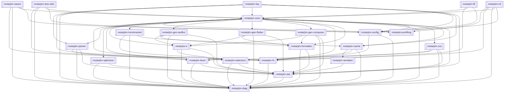

# Dependency Graph

```mermaid
graph TD
    motarjim_ast[[motarjim-ast]]
    motarjim_cache[[motarjim-cache]]
    motarjim_cli[[motarjim-cli]]
    motarjim_config[[motarjim-config]]
    motarjim_core[[motarjim-core]]
    motarjim_css[[motarjim-css]]
    motarjim_diag[[motarjim-diag]]
    motarjim_ffi[[motarjim-ffi]]
    motarjim_formatter[[motarjim-formatter]]
    motarjim_fs[[motarjim-fs]]
    motarjim_gen_compose[[motarjim-gen-compose]]
    motarjim_gen_flutter[[motarjim-gen-flutter]]
    motarjim_gen_swiftui[[motarjim-gen-swiftui]]
    motarjim_incremental[[motarjim-incremental]]
    motarjim_ir[[motarjim-ir]]
    motarjim_lexer[[motarjim-lexer]]
    motarjim_lsp[[motarjim-lsp]]
    motarjim_optimizer[[motarjim-optimizer]]
    motarjim_parser[[motarjim-parser]]
    motarjim_profiling[[motarjim-profiling]]
    motarjim_selectors[[motarjim-selectors]]
    motarjim_serialize[[motarjim-serialize]]
    motarjim_test_utils[[motarjim-test-utils]]
    motarjim_wasm[[motarjim-wasm]]

    motarjim_ast --> motarjim_diag
    motarjim_cache --> motarjim_diag
    motarjim_cache --> motarjim_fs
    motarjim_cache --> motarjim_serialize
    motarjim_cli --> motarjim_config
    motarjim_cli --> motarjim_core
    motarjim_cli --> motarjim_diag
    motarjim_cli --> motarjim_fs
    motarjim_cli --> motarjim_profiling
    motarjim_config --> motarjim_diag
    motarjim_config --> motarjim_fs
    motarjim_core --> motarjim_ast
    motarjim_core --> motarjim_cache
    motarjim_core --> motarjim_config
    motarjim_core --> motarjim_css
    motarjim_core --> motarjim_diag
    motarjim_core --> motarjim_formatter
    motarjim_core --> motarjim_fs
    motarjim_core --> motarjim_gen_compose
    motarjim_core --> motarjim_gen_flutter
    motarjim_core --> motarjim_gen_swiftui
    motarjim_core --> motarjim_incremental
    motarjim_core --> motarjim_ir
    motarjim_core --> motarjim_lexer
    motarjim_core --> motarjim_optimizer
    motarjim_core --> motarjim_parser
    motarjim_core --> motarjim_profiling
    motarjim_core --> motarjim_selectors
    motarjim_css --> motarjim_ast
    motarjim_css --> motarjim_diag
    motarjim_css --> motarjim_lexer
    motarjim_css --> motarjim_selectors
    motarjim_ffi --> motarjim_config
    motarjim_ffi --> motarjim_core
    motarjim_ffi --> motarjim_fs
    motarjim_formatter --> motarjim_ast
    motarjim_formatter --> motarjim_diag
    motarjim_fs --> motarjim_diag
    motarjim_gen_compose --> motarjim_ast
    motarjim_gen_compose --> motarjim_diag
    motarjim_gen_compose --> motarjim_formatter
    motarjim_gen_compose --> motarjim_ir
    motarjim_gen_flutter --> motarjim_ast
    motarjim_gen_flutter --> motarjim_diag
    motarjim_gen_flutter --> motarjim_formatter
    motarjim_gen_flutter --> motarjim_ir
    motarjim_gen_swiftui --> motarjim_ast
    motarjim_gen_swiftui --> motarjim_diag
    motarjim_gen_swiftui --> motarjim_formatter
    motarjim_gen_swiftui --> motarjim_ir
    motarjim_incremental --> motarjim_cache
    motarjim_incremental --> motarjim_diag
    motarjim_incremental --> motarjim_fs
    motarjim_ir --> motarjim_ast
    motarjim_ir --> motarjim_diag
    motarjim_ir --> motarjim_selectors
    motarjim_lexer --> motarjim_ast
    motarjim_lexer --> motarjim_diag
    motarjim_lsp --> motarjim_ast
    motarjim_lsp --> motarjim_cache
    motarjim_lsp --> motarjim_config
    motarjim_lsp --> motarjim_core
    motarjim_lsp --> motarjim_diag
    motarjim_lsp --> motarjim_fs
    motarjim_lsp --> motarjim_parser
    motarjim_optimizer --> motarjim_ast
    motarjim_optimizer --> motarjim_diag
    motarjim_parser --> motarjim_ast
    motarjim_parser --> motarjim_diag
    motarjim_parser --> motarjim_lexer
    motarjim_selectors --> motarjim_ast
    motarjim_selectors --> motarjim_diag
    motarjim_serialize --> motarjim_ast
    motarjim_test_utils --> motarjim_config
    motarjim_test_utils --> motarjim_core
    motarjim_test_utils --> motarjim_diag
    motarjim_test_utils --> motarjim_fs
    motarjim_wasm --> motarjim_config
    motarjim_wasm --> motarjim_core
    motarjim_wasm --> motarjim_diag
    motarjim_wasm --> motarjim_fs
```
