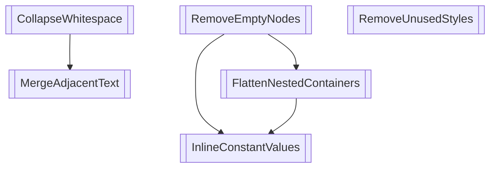

# Optimization Pass Dependency Graph

## Pass Details

| Pass | Prerequisites | Invalidates |
|------|--------------|-------------|
| RemoveEmptyNodes | none | RemoveEmptyNodes, MergeAdjacentText, FlattenNestedContainers, InlineConstantValues |
| MergeAdjacentText | CollapseWhitespace | RemoveEmptyNodes, MergeAdjacentText |
| CollapseWhitespace | none | MergeAdjacentText, CollapseWhitespace |
| RemoveUnusedStyles | none | RemoveUnusedStyles |
| FlattenNestedContainers | RemoveEmptyNodes | FlattenNestedContainers, InlineConstantValues |
| InlineConstantValues | RemoveEmptyNodes, FlattenNestedContainers | InlineConstantValues |

